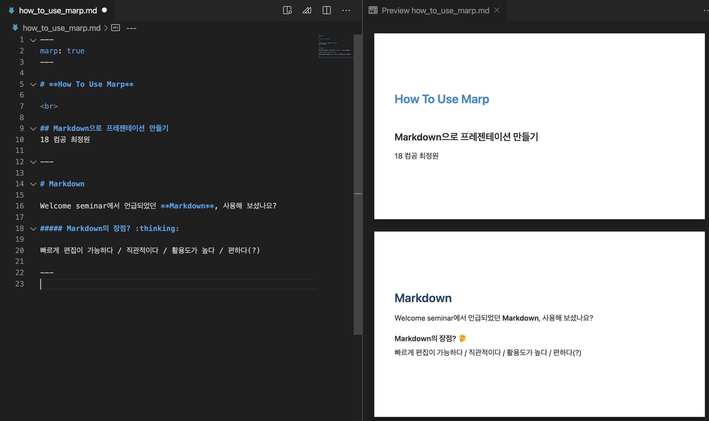
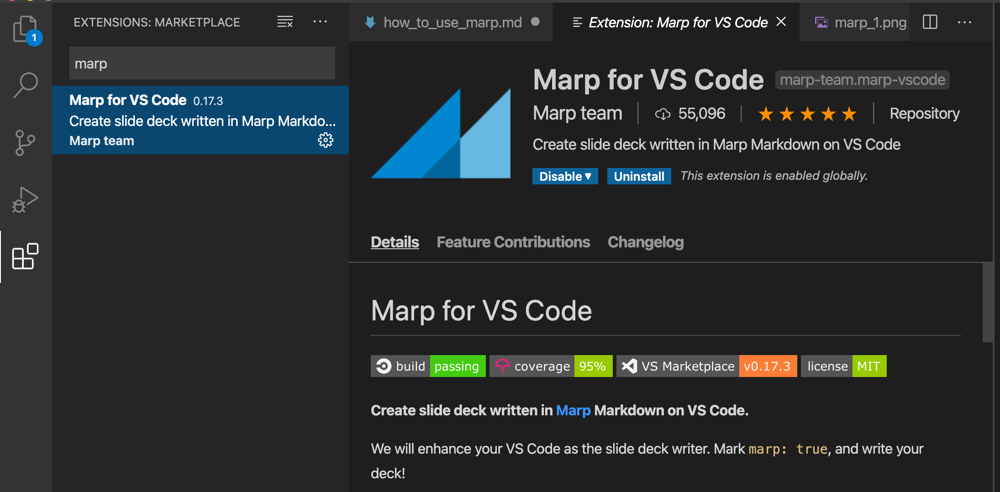
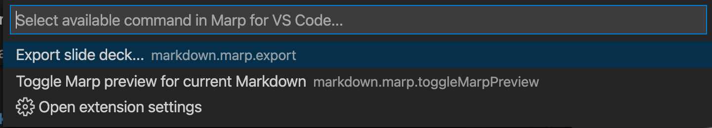

# **How To Use Marp**


<br>

## Markdown의 장점? :thinking:

빠르게 편집이 가능하다 / 직관적이다 / 활용도가 높다 / 편하다(?)




## Before use Marp: TODOs

1. Markdown 문법 익히기
2. vscode에 **Marp for VS Code** extension 설치하기
3. Marp 문법 익히기
4. (선택 1) CSS/HTML 익히기
5. (선택 2) Emoji

<br>

## 1. Markdown 문법 익히기

*엄 청 쉽 다 ~~(진짜)~~*


## 2. vscode에 **Marp for VS Code** extension 설치하기







## 3. Marp 문법 익히기

- markdown 문서의 제일 위에 marp를 사용할 것을 명시한다.
    ```
    ---
    marp: true
    ---
    ```
- 슬라이드의 분할은 `---`을 이용한다.
- image는 `` 방식으로 받아온다.
  - `[]` 속에 인자를 넣어 사이즈 조절이나 filtering 가능.

## 4. (선택 1) CSS/HTML 익히기

CSS/HTML을 이용하여 디자인을 할 수 있다. 

### 방법1) 아래와 같이 style tag를 markdown 문서의 상단부에 작성해 준다.(global scope)
```html
<style>
section {
  background: green;
}
</style>
```
`<style scoped> </style>` 태그로 감싸주면 해당 페이지에서만 style을 적용할 수 있다.


### 방법2) CSS 파일을 생성하여 theme을 custom한다. 

font size나 color, padding, header, footer 등 다양한 요소들을 취항껏 설정할 수 있다.
```css
/* @theme custom-theme */

@import 'base';
section {
  background-color: #369;
}
```
공식문서에 더 자세한 내용이 있으니 살펴보도록 하자.
https://marpit.marp.app/theme-css

## 5. (선택 2) Emoji

`:+1:`, `:thinking:` 와 같이 `:{emoji_name}:`을 통해 emoji를 삽입할 수 있다. 

emoji의 이름이 궁금하다면 **markdown emoji** 등의 형식으로 구글링하면 된다.

ex) :+1: :thinking: :smile: :eyes: :tada: :hand: :pray: :computer: :bulb: :cat:


## 따끈따근한 Tip :bulb:

특정 이미지를 가운데 정렬하고 싶다?
```html
<style>
img[alt~="center"] {
  display: block;
  margin: 0 auto;
}
</style>


```
만약 scope 내의 모든 이미지를 가운데 정렬을 하고 싶다면, `[alt~="center]`를 지우고 ``로 이미지를 받아오면 된다.

## 따끈따끈한 Tip Again :fire:

제목 색을 바꾸고 싶다?
```html
<style scoped>
h1 {
    color: #ad2626
}
</style>
```
위와 같은 방식으로 각 요소들의 색상을 정해줄 수 있다.(ex. 본문의 경우 h1 대신 p 사용)

HEX 색상의 경우 google에 `color picker`로 검색을 하거나 임의의 HEX 코드를 입력하면 원하는 색의 HEX 뿐만 아니라 RGB, CMYK 정보를 추출할 수 있다.

<hr>

### 참고문헌

- [marp 공식 문서](https://marpit.marp.app/)
- [marp GitHub](https://github.com/marp-team/marp-vscode)